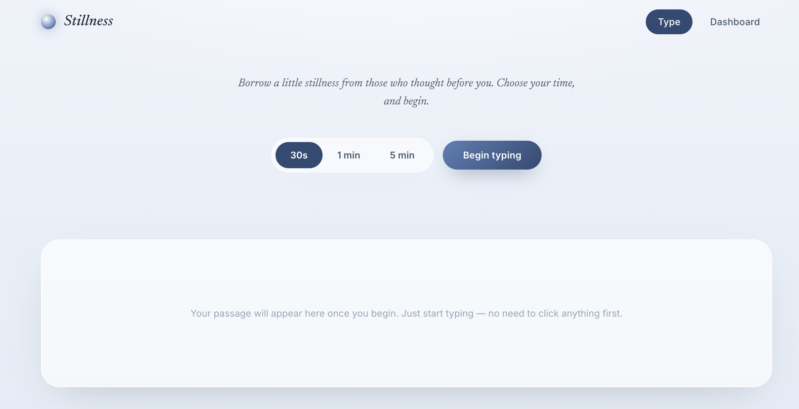
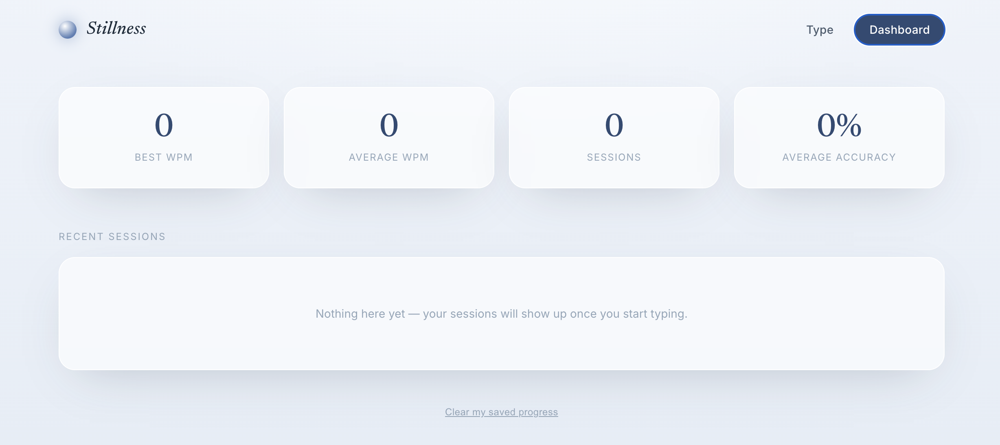

# ⌨️ Typing Test Web

A modern and responsive typing speed test application built using HTML, CSS, and JavaScript. Test your typing speed, improve your accuracy, and monitor your performance in real time.

## 🌐 Live Demo

https://assistant18689-cmyk.github.io/typingtestweb/

---

## ✨ Features

- ⌨️ Real-time typing test
- ⚡ Live Words Per Minute (WPM) calculation
- 🎯 Accuracy tracking
- ⏱️ Countdown timer
- 📊 Instant performance results
- 📱 Fully responsive design
- 🎨 Clean and modern user interface

---

## 🛠️ Technologies Used

- HTML5
- CSS3
- JavaScript

---

## 📸 Screenshots

### Home Page



### Results



---

## 📂 Project Structure

```
typingtestweb/
│
├── index.html
├── README.md
├── favicon.png
└── screenshots/
    ├── home.png
    └── resultdashboard.png
```

---

## 🎯 Purpose

This project was built to practice front-end web development by creating an interactive web application using JavaScript. It demonstrates DOM manipulation, event handling, timers, and real-time data updates while maintaining a responsive and user-friendly interface.

---

## 🚀 Future Improvements

- Multiple difficulty levels
- Different test durations
- Random paragraph generator
- Dark/Light mode
- Typing history using Local Storage
- Sound effects
- Leaderboard

---

## 👨‍💻 Author

GitHub: https://github.com/assistant18689-cmyk
